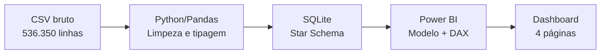

# 🛒 E-commerce Loyalty Analysis: Pipeline de Dados & Segmentação de Clientes

Pipeline de dados ponta a ponta — **Ingestão (Python) → Modelagem Dimensional (SQL) → Business Intelligence (Power BI)** — construído sobre uma base real de transações de e-commerce/atacado, com foco em responder perguntas de negócio sobre retenção, valor de cliente e cancelamento.

> 💡 **O diferencial deste projeto não é só o resultado final — é o processo de auditoria dos dados.** Ao longo do desenvolvimento, identifiquei e corrigi um bug estrutural que distorcia o faturamento total em ~31%, outliers extremos que inflavam métricas de cancelamento, e uma falha de não-determinismo na segmentação de clientes. A seção [Jornada de Auditoria de Dados](#-jornada-de-auditoria-de-dados) documenta cada um desses achados.

---

## 📊 Perguntas de negócio respondidas

1. Como o faturamento evolui ao longo do tempo, e existe sazonalidade?
2. Quais clientes geram mais valor, e como segmentá-los de forma acionável?
3. Qual a taxa de retenção real dos clientes ao longo dos meses?
4. Onde a empresa está perdendo dinheiro com cancelamentos, e por quê?
5. Os dados brutos são confiáveis o suficiente para embasar essas decisões?

---

## 🗂️ Fonte de dados

Dataset público **"An Online Shop Business"** ([Kaggle](https://www.kaggle.com/datasets/gabrielramos87/an-online-shop-business)), com 536.350 transações de uma varejista/atacadista do Reino Unido, cobrindo dez/2018 a dez/2019 (o último mês é parcial — dados até 09/12).

Os valores monetários originais estão em **libras esterlinas (GBP)**. Para leitura em português, os valores são apresentados também em **Reais (BRL)**, convertidos à cotação de **R$ 6,9277**, parametrizada explicitamente no modelo do Power BI para rastreabilidade (não é um valor "hardcoded" nas colunas de origem).

---

## 🛠️ Arquitetura do projeto



### 1. Ingestão e Data Wrangling (Python)
- Tradução de colunas e de 32+ países para português (com fallback para valores não mapeados)
- Padronização de datas (`M/D/AAAA` → `AAAA-MM-DD`)
- Tipagem correta de `id_cliente` (evitando a promoção indevida para `float`, comum quando há nulos)
- Remoção de duplicatas e de registros sem cliente identificado, com contagem registrada
- Criação de `flag_cancelado` a partir do prefixo `'C'` no identificador de transação — validada cruzando com o sinal de quantidade negativa (**0 divergências** encontradas)
- Sinalização (não exclusão) de outliers de quantidade via método IQR, calculado apenas sobre vendas válidas
- Relatório de qualidade de dados gerado automaticamente a cada execução

### 2. Modelagem Dimensional (SQL / Star Schema)
```
dim_clientes   (id_cliente, pais_cliente)
dim_produtos   (id_produto, nome_produto)
fato_vendas    (id_transacao, id_cliente, id_produto, data_transacao,
                quantidade, preco_unitario, flag_cancelado, flag_outlier_quantidade)
```
Índices aplicados nas chaves de junção e nos filtros mais usados (`flag_cancelado`).

### 3. Business Intelligence (Power BI)
Conexão direta ao SQLite via ODBC, com medidas DAX para as métricas de negócio e views SQL pré-agregadas (RFM, coorte, sazonalidade) consumidas diretamente — evitando duplicar lógica de negócio entre camadas.

---

## 🔍 Jornada de Auditoria de Dados

Esta seção documenta os problemas reais encontrados durante o desenvolvimento — e por que eles importam.

### 1. Bug estrutural no faturamento total (~31% de distorção)
A primeira versão da modelagem populava `preco_unitario` na tabela de dimensão de produtos via `GROUP BY id_produto` **sem função de agregação** — um comportamento não-determinístico do SQLite que escolhe um valor arbitrário por grupo. Como o preço varia por transação (promoções, reajustes), isso inflava/distorcia o cálculo de receita.

**Correção:** o atributo `preco_unitario` foi movido para a tabela fato (granularidade correta — preço é um atributo da transação, não do produto).

**Impacto:** o faturamento total saiu de um valor incorreto de ~R$ 42 Mi (não confiável) para o valor auditado e validado por **três métodos independentes** (soma direta, agregação mensal, agregação por dia da semana): **£ 62.781.304,54** (≈ R$ 434,93 Mi).

### 2. Outliers extremos de cancelamento
Duas transações isoladas — uma de -80.995 unidades (£ 501 mil) e outra de -74.215 unidades (£ 840 mil) — distorciam a leitura de padrões típicos de cancelamento. Ambas foram identificadas, investigadas (uma delas revelou um cliente que comprou e cancelou um pedido de atacado inteiro, sem gerar receita líquida) e documentadas separadamente, em vez de simplesmente descartadas sem registro.

### 3. Segmentação RFM não-determinística
A função `NTILE()` usada para gerar os scores de Recência/Frequência/Monetário não tinha critério de desempate — clientes com valores idênticos podiam cair em quintis diferentes dependendo da ordem física das linhas retornada pelo motor de conexão. Corrigido adicionando `id_cliente` como critério de desempate secundário, garantindo resultado estável e reprodutível.

### 4. Duas definições distintas de "cliente" (não é erro, é definição)
A base de clientes distintos totaliza **4.738**, mas apenas **4.718** possuem ao menos uma compra válida (não cancelada) — os 20 restantes aparecem na base exclusivamente com pedidos cancelados, sem nenhuma transação concluída. Toda a análise de valor e segmentação (RFM) considera os 4.718 clientes com compra válida; o KPI "Total Clientes Ativos" do dashboard foi ajustado para refletir essa mesma definição, evitando inflar artificialmente a base ativa com clientes que nunca geraram receita.

### 5. Anomalias temporais confirmadas (não são bugs)
- **Nenhuma transação registrada às terças-feiras** em todo o período — validado com uma contagem de controle isolada, e não é uma característica de amostra pequena: é ausência total, possivelmente uma particularidade operacional da fonte original.
- **Dezembro/2019 é um mês parcial** (dados só até o dia 09) — sinalizado visualmente em todos os gráficos temporais e excluído de conclusões sobre sazonalidade/retenção nesse período.

---

## 💡 Principais Insights de Negócio

### Concentração de valor: a regra 22/63
A segmentação RFM (Recência, Frequência, Monetário, com *scoring* por quintil, não por thresholds arbitrários) revela que **22% dos clientes ("Campeões") respondem por 63% de todo o faturamento**. O segmento "Em Risco (Alto Valor)" — clientes que já gastaram muito, mas pararam de comprar — representa o alvo mais acionável para campanhas de reativação.

### O gargalo da primeira compra
A análise de coorte de retenção mostra que apenas **35% dos clientes do coorte de dez/2018 ainda estavam ativos 6 meses depois**. Isso reforça que o maior ponto de perda de receita não é a aquisição, e sim a falta de conversão para uma segunda compra.

### Padrões temporais
- **Domingo** é o dia de maior faturamento; **quarta-feira**, o menor (nenhuma terça-feira registrada em todo o período)
- **Novembro/2019** foi o mês de pico de vendas
- O Reino Unido domina o volume absoluto, mas **Holanda, Austrália, Japão e Suécia** lideram em ticket médio por pedido (com volume mínimo de pedidos aplicado para evitar viés de amostra pequena)

### Cancelamentos
Taxa de cancelamento de ~16,4% dos pedidos, concentrada no Reino Unido — mas com achados pontuais relevantes (ver seção de auditoria) que, uma vez isolados, revelam um padrão de cancelamento mais estável e menos distorcido do que os números brutos sugeririam.

---

## 📈 Dashboard (Power BI)

O relatório é organizado em 4 páginas, cada uma respondendo a uma pergunta de negócio específica:

| Página | Foco |
|---|---|
| **Visão Executiva** | KPIs gerais, tendência de faturamento, faturamento por país |
| **Segmentação RFM** | Distribuição e valor por segmento de cliente, lista acionável de clientes em risco |
| **Comportamento Temporal** | Sazonalidade, dia da semana, matriz de coorte de retenção (absoluta e percentual) |
| **Cancelamentos e Impacto Financeiro** | Prejuízo por país/produto, nota de qualidade de dados |

---

## 🚀 Estrutura do repositório

```
├── notebooks/       # Ingestão e limpeza de dados (Python)
├── sql/             # Modelagem dimensional e queries analíticas
│   └── archive/     # Versões anteriores mantidas para referência histórica
├── dashboard/       # Arquivo Power BI (.pbix)
└── data/            # Dataset bruto (não incluído — baixar do Kaggle) e relatório de qualidade
```

**Pré-requisitos:** Python 3.x com `pandas`; SQLite; Power BI Desktop com driver ODBC SQLite.

O dataset original está disponível em [Kaggle](https://www.kaggle.com/datasets/gabrielramos87/an-online-shop-business) e não está incluído neste repositório por questão de tamanho.

---

## 🧰 Stack técnica

- **Python** (Pandas) — ingestão e limpeza de dados
- **SQL** (SQLite) — modelagem dimensional, RFM, coorte, agregações de negócio
- **Power BI** (DAX, Power Query) — visualização e storytelling de dados
- **Power Query M** — conexão ODBC direta ao banco SQLite

---

## 👤 Autor

Lucas Amaral