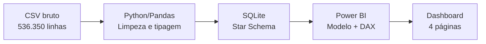
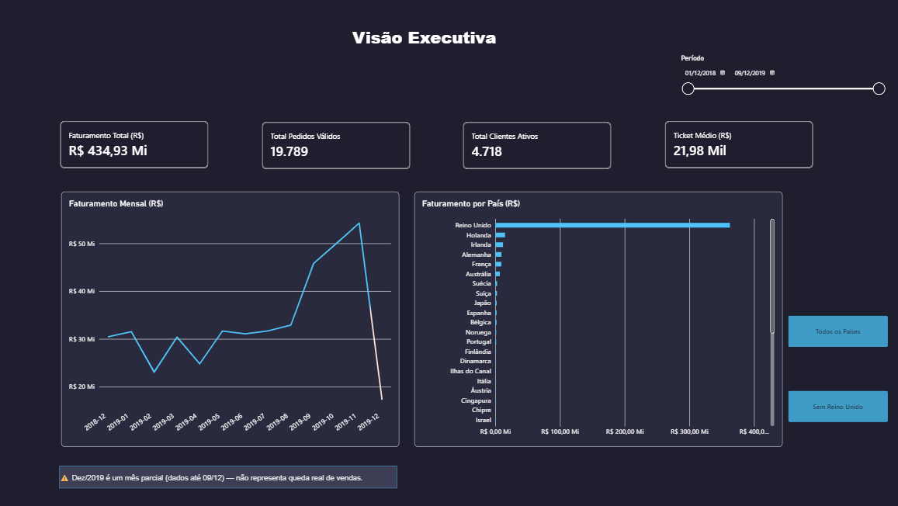
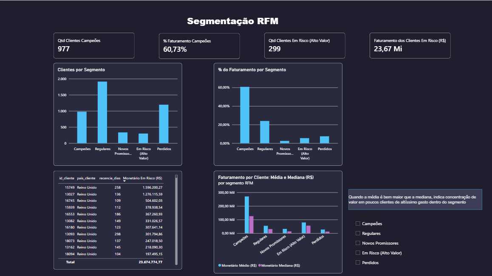
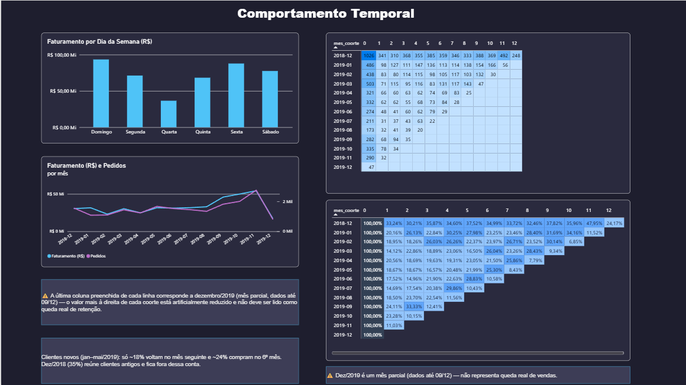
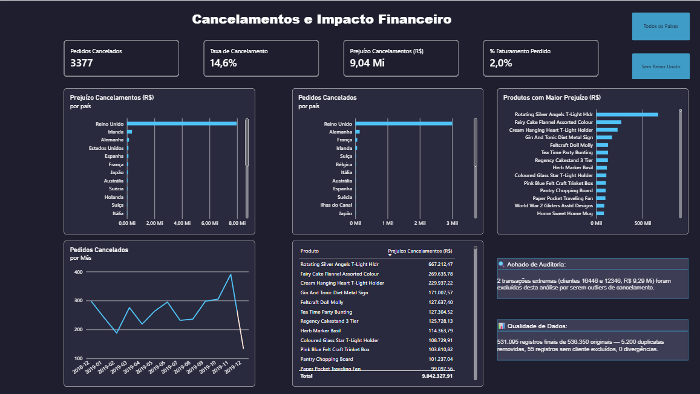

# 🛒 E-commerce Loyalty Analysis: Pipeline de Dados & Segmentação de Clientes

Pipeline de dados ponta a ponta — **Ingestão (Python) → Modelagem Dimensional (SQL) → Business Intelligence (Power BI)** — construído sobre uma base real de transações de e-commerce/atacado, com foco em responder perguntas de negócio sobre retenção, valor de cliente e cancelamento.

> 💡 **O diferencial deste projeto não é só o resultado final — é o processo de auditoria dos dados.** Ao longo do desenvolvimento, identifiquei e corrigi um bug estrutural que subestimava o faturamento total em cerca de um terço, outliers extremos que inflavam métricas de cancelamento, e uma falha de não-determinismo na segmentação de clientes. A seção [Jornada de Auditoria de Dados](#-jornada-de-auditoria-de-dados) documenta cada um desses achados.

---

## 📊 Perguntas de negócio respondidas

1. Como o faturamento evolui ao longo do tempo, e existe sazonalidade?
2. Quais clientes geram mais valor, e como segmentá-los de forma acionável?
3. Qual a taxa de retenção real dos clientes ao longo dos meses?
4. Onde a empresa está perdendo dinheiro com cancelamentos, e por quê?
5. Os dados brutos são confiáveis o suficiente para embasar essas decisões?

---

## 🗂️ Fonte de dados

Dataset público **"An Online Shop Business"** ([Kaggle](https://www.kaggle.com/datasets/gabrielramos87/an-online-shop-business)), com 536.350 transações de uma varejista/atacadista do Reino Unido, cobrindo dez/2018 a dez/2019 (o último mês é parcial — dados até 09/12).

Os valores monetários originais estão em **libras esterlinas (GBP)**. Para leitura em português, os valores são apresentados também em **Reais (BRL)**, convertidos à cotação de **R$ 6,9277**, parametrizada explicitamente no modelo do Power BI para rastreabilidade (não é um valor "hardcoded" nas colunas de origem).

A moeda de referência do projeto é a **libra (£)**; os valores em R$ são apenas uma conversão de leitura. A conversão usa uma cotação fixa de R$ 6,9277 (não a da época), aplicada a dados de 2019.

**Definição de faturamento:** todos os totais deste projeto são **faturamento bruto** — soma de `quantidade × preco_unitario` das vendas não canceladas: **£ 62.781.304,54**. Descontando os cancelamentos (− £ 2.646.715,27), o faturamento líquido seria £ 60.134.589,27.

---

## 🛠️ Arquitetura do projeto


```mermaid
flowchart LR
    A[CSV bruto<br/>536.350 linhas] --> B[Python/Pandas<br/>Limpeza e tipagem]
    B --> C[SQLite<br/>Star Schema]
    C --> D[Power BI<br/>Modelo + DAX]
    D --> E[Dashboard<br/>4 páginas]
```

### 1. Ingestão e Data Wrangling (Python)
- Tradução de colunas e de 32+ países para português (com fallback para valores não mapeados)
- Padronização de datas (`M/D/AAAA` → `AAAA-MM-DD`)
- Tipagem correta de `id_cliente` (evitando a promoção indevida para `float`, comum quando há nulos)
- Remoção de duplicatas e de registros sem cliente identificado, com contagem registrada
- Criação de `flag_cancelado` a partir do prefixo `'C'` no identificador de transação — validada cruzando com o sinal de quantidade negativa (**0 divergências** encontradas)
- Sinalização (não exclusão) de outliers de quantidade via método IQR, calculado apenas sobre vendas válidas
- Relatório de qualidade de dados gerado automaticamente a cada execução

### 2. Modelagem Dimensional (SQL / Star Schema)
```
dim_clientes   (id_cliente, pais_cliente)
dim_produtos   (id_produto, nome_produto)
fato_vendas    (id_transacao, id_cliente, id_produto, data_transacao,
                quantidade, preco_unitario, flag_cancelado, flag_outlier_quantidade)
```
Índices aplicados nas chaves de junção e nos filtros mais usados (`flag_cancelado`).

### 3. Business Intelligence (Power BI)
Conexão direta ao SQLite via ODBC, com medidas DAX para as métricas de negócio e consultas SQL nativas no Power Query (RFM, coorte, sazonalidade), com a mesma lógica das queries em `sql/` — evitando duplicar lógica de negócio entre camadas.

---

## 🔍 Jornada de Auditoria de Dados

Esta seção documenta os problemas reais encontrados durante o desenvolvimento — e por que eles importam.

### 1. Bug estrutural no faturamento total (subestimação de cerca de um terço)
A primeira versão da modelagem populava `preco_unitario` na tabela de dimensão de produtos via `GROUP BY id_produto` **sem função de agregação** — um comportamento não-determinístico do SQLite que escolhe um valor arbitrário por grupo. Como o preço varia por transação (promoções, reajustes), isso distorcia o cálculo de receita.

**Correção:** o atributo `preco_unitario` foi movido para a tabela fato (granularidade correta — preço é um atributo da transação, não do produto).

**Impacto:** com o preço arbitrário, o faturamento total aparecia como **£ 41,9 Mi** — cerca de 33% (um terço) a menos na reprodução desta auditoria; o valor exato varia entre execuções por ser não-determinístico (reprodução em `sql/investigacoes/03_validacao_bug_preco.sql`). O valor auditado e validado por **três métodos independentes** (soma direta, agregação mensal, agregação por dia da semana) é **£ 62.781.304,54** (≈ R$ 434,93 Mi).

### 2. Outliers extremos de cancelamento
Duas transações isoladas — uma de -80.995 unidades (£ 501 mil) e outra de -74.215 unidades (£ 840 mil) — distorciam a leitura de padrões típicos de cancelamento. Ambas foram identificadas, investigadas (uma delas revelou um cliente que comprou e cancelou um pedido de atacado inteiro, sem gerar receita líquida) e documentadas separadamente, em vez de simplesmente descartadas sem registro. No outro caso (cliente 16446), o cancelamento das 80.995 unidades foi registrado a £ 6,19 por unidade, metade dos £ 12,38 da compra original — por isso estorna só £ 501 mil de uma compra de £ 1,00 Mi. A anomalia vem da própria fonte de dados e não foi corrigida, apenas documentada.

### 3. Segmentação RFM não-determinística
A função `NTILE()` usada para gerar os scores de Recência/Frequência/Monetário não tinha critério de desempate — clientes com valores idênticos podiam cair em quintis diferentes dependendo da ordem física das linhas retornada pelo motor de conexão. Corrigido adicionando `id_cliente` como critério de desempate secundário, garantindo resultado estável e reprodutível.

### 4. Duas definições distintas de "cliente" (não é erro, é definição)
A base de clientes distintos totaliza **4.738**, mas apenas **4.718** possuem ao menos uma compra válida (não cancelada) — os 20 restantes aparecem na base exclusivamente com pedidos cancelados, sem nenhuma transação concluída. Toda a análise de valor e segmentação (RFM) considera os 4.718 clientes com compra válida; o KPI "Total Clientes Ativos" do dashboard foi ajustado para refletir essa mesma definição, evitando inflar artificialmente a base ativa com clientes que nunca geraram receita.

### 5. Anomalias temporais confirmadas (não são bugs)
- **Nenhuma transação registrada às terças-feiras** em todo o período — validado com uma contagem de controle isolada, e não é uma característica de amostra pequena: é ausência total, possivelmente uma particularidade operacional da fonte original.
- **Dezembro/2019 é um mês parcial** (dados só até o dia 09) — sinalizado visualmente em todos os gráficos temporais e excluído de conclusões sobre sazonalidade/retenção nesse período.

### 6. Validação cruzada com outro projeto público
Um [notebook público independente](https://github.com/mdrakibhasanrc/Python_Portfolio/blob/main/E-commerce%20Business%20Sales%20Analysis%20.ipynb) sobre a mesma base chegou aos mesmos números de limpeza: **5.200 duplicados**, **55 registros sem cliente** e **522.601 linhas válidas** (vendas não canceladas). A diferença está nos outliers de quantidade: lá eles foram **removidos** por IQR, o que elimina boa parte dos pedidos de atacado e explica totais de receita menores; aqui eles foram **sinalizados** (`flag_outlier_quantidade`), preservando a receita. Os dois projetos concordam que **domingo** é o dia de maior faturamento e **quarta-feira**, o menor.

---

## 💡 Principais Insights de Negócio

### Concentração de valor: 20% dos clientes geram 73% da receita
A segmentação RFM (Recência, Frequência, Monetário, com *scoring* por quintil, não por thresholds arbitrários) revela que os **"Campeões" — 20,7% dos clientes — respondem por 60,7% do faturamento** (`sql/10_resumo_segmentos_rfm.sql`). Como esse segmento já é filtrado por valor monetário, o teste direto de concentração é a curva de Pareto, que ordena os clientes **apenas por faturamento** (`sql/11_curva_pareto_clientes.sql`): **os top 20% dos clientes geram 72,9% da receita**, e só o top 1% (47 clientes) gera 29,8%.

O Princípio de Pareto (80/20) é uma heurística empírica, não uma lei: os números mostram uma concentração forte, coerente com o princípio, mas não um 80/20. Isso também é um risco — a receita depende de poucos clientes, e a perda de algumas contas grandes teria impacto desproporcional. O segmento "Em Risco (Alto Valor)" — clientes que já gastaram muito, mas pararam de comprar — representa o alvo mais acionável para campanhas de reativação.

### O gargalo da primeira compra
Entre os clientes novos (coortes de jan a mai/2019), só **~18% voltam a comprar no mês seguinte** e **~24% compram no 6º mês** (`sql/12_retencao_coortes_novos.sql`). O coorte de dez/2018 (35%) não entra nessa conta porque reúne a base de clientes antigos (ver Limitações). A métrica conta quem comprou naquele mês, por isso o 6º mês pode superar o 1º. Uma hipótese não testada é a alta temporada de jul a nov/2019. Conclusão: o principal desafio não é atrair clientes, e sim converter a primeira compra em recorrência.

### Padrões temporais
- **Domingo** é o dia de maior faturamento; **quarta-feira**, o menor (nenhuma terça-feira registrada em todo o período)
- **Novembro/2019** foi o mês de pico de vendas
- O Reino Unido domina o volume absoluto, mas **Holanda, Austrália, Japão e Suécia** lideram em ticket médio por pedido (com volume mínimo de pedidos aplicado para evitar viés de amostra pequena)

### Cancelamentos
~14,6% dos pedidos são cancelados, mas eles representam só ~4,2% do faturamento bruto. Os cancelamentos se concentram no Reino Unido — mas com achados pontuais relevantes (ver seção de auditoria) que, uma vez isolados, revelam um padrão de cancelamento mais estável e menos distorcido do que os números brutos sugeririam.

---

## ⚠️ Limitações

- **Faturamento, não lucro:** a base não tem custo dos produtos, então as análises tratam de faturamento, não de margem ou lucro.
- **Faturamento bruto:** O faturamento oficial é bruto (vendas não canceladas). Os cancelamentos equivalem a ~4,2% desse valor (£ 2,65 Mi). RFM e Pareto também usam valores brutos, então incluem £ 1,84 Mi dos dois pedidos de atacado cancelados (clientes 12346 e 16446), cerca de 2,9% do total. Isso foi mantido para preservar consistência com o total oficial.
- **Empates no RFM:** os empates nos quintis (`NTILE`) são resolvidos por `id_cliente`. O resultado é reprodutível, mas a escolha entre clientes empatados é arbitrária.
- **Censura na coorte:** à esquerda, o dataset começa em dez/2018, então esse coorte reúne a base de clientes antigos (quem já comprava antes aparece como "novo" nesse mês) e fica fora da manchete de retenção; à direita, dez/2019 é parcial e os coortes mais recentes têm menos meses observáveis.
- **Nomes de produto em inglês:** mantidos em inglês para preservar a correspondência exata com a fonte original e facilitar a rastreabilidade.

---

## 📈 Dashboard (Power BI)

O relatório é organizado em 4 páginas, cada uma respondendo a uma pergunta de negócio específica:

| Página | Foco |
|---|---|
| **Visão Executiva** | KPIs gerais, tendência de faturamento, faturamento por país |
| **Segmentação RFM** | Distribuição e valor por segmento de cliente, lista acionável de clientes em risco |
| **Comportamento Temporal** | Sazonalidade, dia da semana, matriz de coorte de retenção (absoluta e percentual) |
| **Cancelamentos e Impacto Financeiro** | Prejuízo por país/produto, nota de qualidade de dados |

O relatório possui 4 páginas cobrindo a visão executiva, segmentação RFM, comportamento temporal e cancelamentos, conforme os painéis ilustrados abaixo:
<p align="center">
  
  
</p>

<p align="center">
  
  
</p>

---

## 🚀 Estrutura do repositório

```
├── notebooks/                        # Ingestão e limpeza de dados (Python)
├── sql/                              # Modelagem dimensional (00_) e queries analíticas (01_ a 12_)
│   ├── 10_resumo_segmentos_rfm.sql   # Resumo RFM: clientes e faturamento por segmento
│   ├── 11_curva_pareto_clientes.sql  # Curva de Pareto: concentração de receita por cliente
│   ├── 12_retencao_coortes_novos.sql # Retenção M1/M6 dos clientes novos (coortes de jan a mai/2019)
│   ├── investigacoes/                # Queries de auditoria (outliers, terças-feiras, bug de preço, calibragem IQR)
│   └── Arquivos/                     # Versões descontinuadas, mantidas para referência histórica
├── dashboard/                        # Prints do relatório Power BI (o .pbix não é versionado)
│   └── imagens/                      # Prints das 4 páginas do relatório
└── data/                             # Dataset bruto (não incluído — baixar do Kaggle) e relatório de qualidade
```

O arquivo Power BI (.pbix) não está no repositório porque depende de uma conexão ODBC local ao banco SQLite. Os prints das 4 páginas e as queries em `sql/` documentam os resultados completos. O .pbix funcional pode ser enviado mediante solicitação.

**Pré-requisitos:** Python 3.x com `pandas`; SQLite; Power BI Desktop com driver ODBC SQLite.

O dataset original está disponível em [Kaggle](https://www.kaggle.com/datasets/gabrielramos87/an-online-shop-business) e não está incluído neste repositório por questão de tamanho.

---

## 🧰 Stack técnica

- **Python** (Pandas) — ingestão e limpeza de dados
- **SQL** (SQLite) — modelagem dimensional, RFM, coorte, agregações de negócio
- **Power BI** (DAX, Power Query) — visualização e storytelling de dados
- **Power Query M** — conexão ODBC direta ao banco SQLite

---

## 👤 Autor

Lucas Amaral
